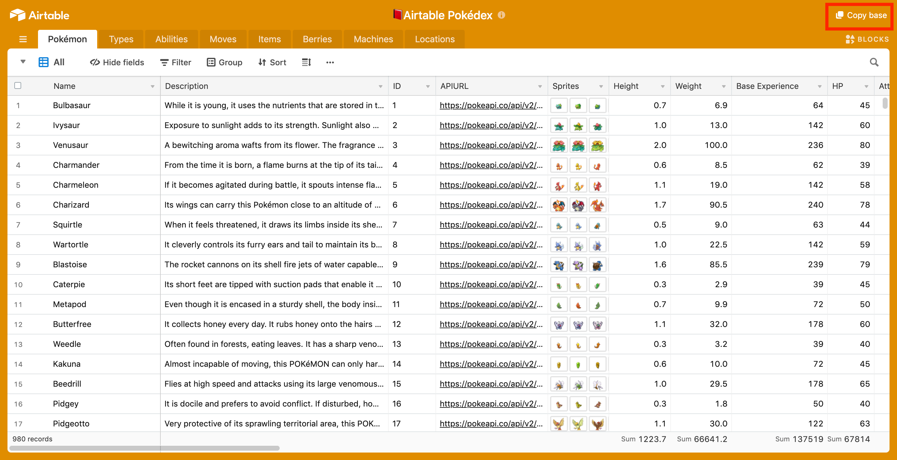

# [Go Airtable](https://godoc.org/github.com/mottaquikarim/go-airtable)
Simple Airtable client written in go

## Installation

```bash
go get github.com/mottaquikarim/go-airtable
```

## Usage

Let's make a simple request to the [pokédex](https://airtable.com/shrOgMitqYo4PE2GW). You can copy this base by clicking the top left "Copy" button and test against this data yourself 👍.



```go
import (
  "github.com/mottaquikarim/go-airtable"
)

acc := airtable.Account{
	ApiKey: "XXXX",
	BaseId: "XXXX",
}

pokédex := airtable.NewTable("pokémon", acc)
original_generation, err := pokédex.List(airtable.Options{
	// Airtable has an API limit of 100 records per page
	MaxRecords: 100,
	// override the default "Grid view" name
	View: "All",
})
if err != nil {
	// handle error
	log.Printf("Error! %v", err)
}

// returned is []Record struct, which contains a Field prop
// that is map[string]interface{} - this can be used anyway
// you like
for _, pokémon := range original_generation {
	log.Printf("ID: %s Name: %v", pokémon.Fields["ID"], pokémon.Fields["Name"])
}
```

## Contributing
Pull requests are welcome. For major changes, please open an issue first to discuss what you would like to change.

Please make sure to update tests as appropriate.

### Run Tests

```bash
make test-dev
```

### Format

```bash
make fmt
```

### Lint

```bash
make lint
```

### CLI

```bash
make build
```

Then,

```bash
make run arguments="-help"
```

Output:
```
Usage: ./airtbl [flags]
  -api-key="XXXXX": Airtable API Key
  -base-id="XXXXX": Airtable Base Id
```

## License
[MIT](https://choosealicense.com/licenses/mit/)
